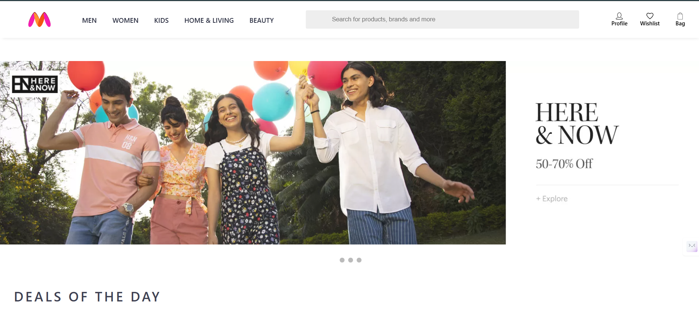
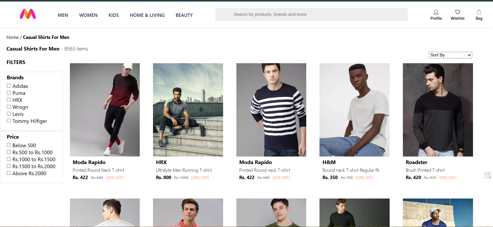
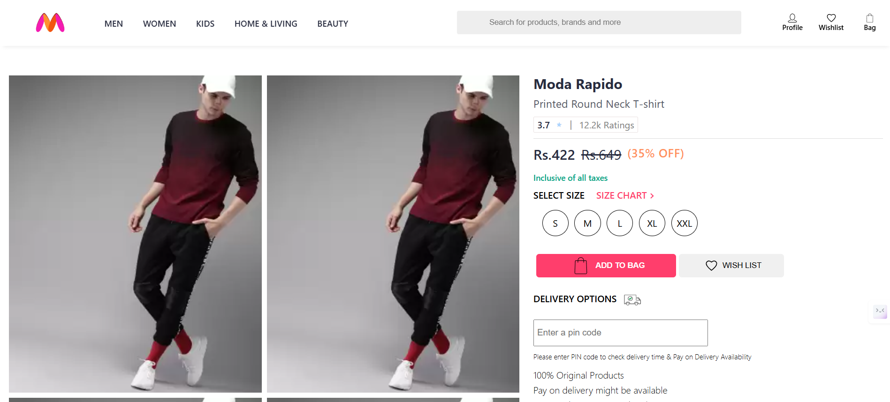

# 🛍️ Myntra Clone

A responsive clone of the **Myntra** e-commerce website built using **HTML**, **CSS**, and **JavaScript**. This project replicates the frontend UI/UX of Myntra and includes features like product listing, navbar, shopping bag, and more.

## 🚀 Demo

🌐 [Live Demo](https://your-live-demo-link.com)  

## 📸 Screenshots


 


---

## 🧰 Tech Stack

- **HTML5** – for structuring the content
- **CSS3** – for styling and responsive design
- **JavaScript (Vanilla)** – for DOM manipulation and dynamic UI behavior

---

## 📦 Features

✅ Responsive design  
✅ Navbar with search and menu icons  
✅ Product listing page  
✅ Add to bag / wishlist UI (frontend only)  
✅ Category and filter UI  
✅ Styled using modern CSS  
✅ Mobile-first responsive layout

---

## 📁 Folder Structure

```bash
myntra-clone/
├── html
├── css
├── js
└── README.md
````

---

## 🧑‍💻 How to Run Locally

```bash
git clone https://github.com/yourusername/myntra-clone.git
cd myntra-clone
open index.html  # or open in browser manually
```

---

## 🙌 Acknowledgements

This project is inspired by the **Myntra.com** website and is built for educational purposes only. All product images and brand assets belong to their respective owners.

---

## 📄 License

This project is open-source and available under the [MIT License](LICENSE).


