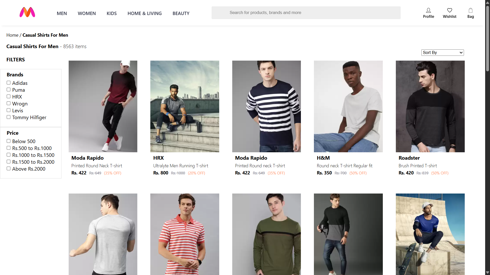
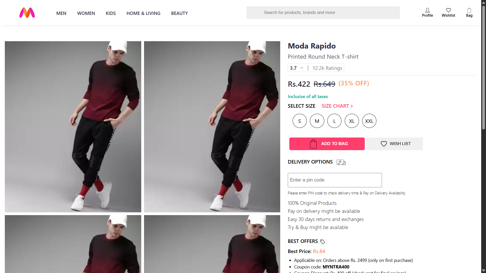
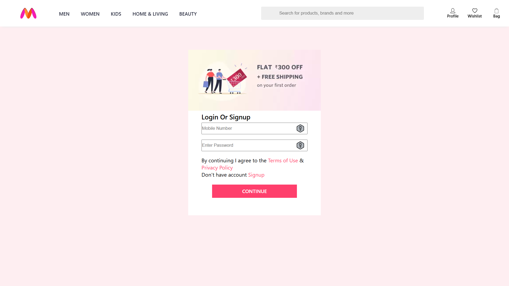

# Myntra Clone

A simple **Myntra e-commerce website clone** built with **HTML, CSS, and JavaScript**. This project recreates the look and feel of the Myntra homepage and basic shopping features for learning and demonstration purposes.

## Features

- Modern, responsive homepage layout
- Product listing with images, prices, and descriptions
- Filtering and sorting options for products
- Add to cart functionality
- Login and registration forms
## Screenshots





## Installation

1. **Clone the repository:**
   ```bash
   git clone [https://github.com/your-username/myntra-clone.git](https://github.com/ShaikQais/myntra_clone/tree/main/myntra_clone-master)
   cd myntra-clone
   ```

2. **Open in your browser:**
   - Just open `home.html` in your preferred browser.

## Usage

- Browse products on the homepage.
- Use the navigation bar or filters to explore categories.
- Click on products to view details.
- Add items to your cart.
- View and manage your cart from the cart icon.
- This is a frontend-only project. No backend or payment processing is included.

## Folder Structure

```
/myntra-clone
  /html      # all Html
  /css         # all CSS files
  /js          # all JavaScript files
  README.md
```

## Technologies Used

- HTML5
- CSS3 (Flexbox/Grid, Responsive design)
- JavaScript (ES6+, DOM manipulation)

## Contributing

Pull requests are welcome! For major changes, please open an issue first to discuss what you would like to change.

## Disclaimer

**This project is for educational purposes only.**  
All product images and trademarks used belong to their respective owners (Myntra). This website clone does not contain any actual commercial functionality.
